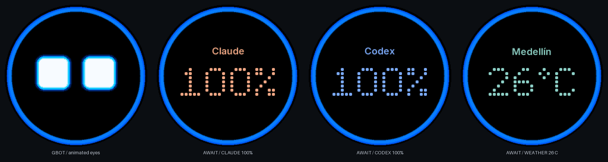
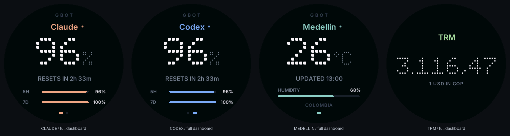

# GBOT

**A tiny desktop companion that makes your availability visible.**

GBOT turns a Waveshare RP2040 board with a round display into an animated desk
robot. Set your focus state from a terminal or the BOOT button, glance at your
Claude and Codex usage, and get a small reminder before your next meeting.

The firmware runs on MicroPython. A Python CLI supplies optional online data
over USB; the board keeps animating when the computer is disconnected and the
board remains powered. No cloud account is required for the core experience.

```sh
gbot busy     # Red: do not interrupt
gbot hold     # Yellow: back soon
gbot await    # Blue: available, but focused
gbot open     # Green: come say hello
```



*Software-rendered preview with sample data; hardware appearance may differ.*

## What it does

- Animated eyes, four availability colors, and reactions to taps and shaking.
- BOOT button controls, display rotation, brightness, and screen sleep.
- Usage dashboards for Claude Code and Codex, including remaining percentages
  and reset countdowns; manual and demo data also work without accounts.
- Weather for Medellín and Colombia's USD/COP reference exchange rate.
- Optional Apple Calendar reminders, five minutes before a meeting.
- A host feed that refreshes data without changing your selected focus state.

## Hardware and platform support

The reference board is the **Waveshare RP2040-LCD-1.28**, the non-touch model
with a **240 × 240 GC9A01A round display** and **QMI8658 motion sensor**.
Start with its [official documentation](https://www.waveshare.com/wiki/RP2040-LCD-1.28)
and [schematic](https://files.waveshare.com/upload/6/60/RP2040-LCD-1.28-sch.pdf).

| Component | Current scope |
| --- | --- |
| Firmware | MicroPython on the Waveshare RP2040-LCD-1.28 |
| Host CLI | Python 3.10+ on macOS and Linux; POSIX serial APIs |
| Apple Calendar and background installer | macOS 14+ for Calendar; macOS for `launchd` |
| Claude usage reader | macOS Keychain integration |
| Windows | No native CLI or installer support in this release |
| Other boards | Porting targets; changes and device testing are required |

The RP2040 reference board has no Wi-Fi. Weather, account usage, and calendar
updates come from the host computer. GBOT is a standalone extraction of the
original HEX project. Its inherited design was developed for this board;
repackaging and host tests do not establish that every GBOT revision has been
flashed or visually checked. See the [validation checklist](docs/development.md#device-validation).

## Get started

You need the board, a USB-C **data** cable, Git, and Python 3.10 or newer.
These commands use a POSIX shell:

```sh
git clone https://github.com/gndx/gbot.git
cd gbot
python3 -m venv .venv
.venv/bin/python -m pip install -r requirements.txt
./scripts/install-cli.sh
```

If the installer reports that `~/.local/bin` is outside your `PATH`, add it to
your shell configuration and open a new terminal. Keep the checkout and `.venv`
in place; the installed command points to them.

1. Download the **v1.29.0 Raspberry Pi Pico UF2** from the
   [official MicroPython download page](https://micropython.org/download/RPI_PICO/).
2. Hold BOOT while connecting USB. Copy the UF2 to the `RPI-RP2` drive, or use
   `./scripts/flash.sh /path/to/firmware.uf2 /path/to/RPI-RP2`.
3. Once the board restarts, list serial ports and deploy to the correct one:

```sh
gbot devices

# macOS example; replace this with the port printed on your machine.
./scripts/deploy.sh /dev/cu.usbmodemXXXX --verify
gbot --device /dev/cu.usbmodemXXXX ping
gbot --device /dev/cu.usbmodemXXXX open
gbot --device /dev/cu.usbmodemXXXX status

# A typical Linux port is /dev/ttyACM0.
```

Deployment replaces GBOT module filenames on the selected board and restarts
it. Back up any existing board files you need first. The
[step-by-step setup guide](docs/getting-started.md) explains bootloader mode,
version matching, serial access, and recovery.

## Daily use

```sh
gbot next                  # Cycle open → await → hold → busy
gbot face                  # Return to the animated eyes
gbot rotate 2              # Rotate the display 180 degrees
gbot bright 65             # Set brightness to 65%
gbot view hud              # Show device telemetry
gbot sleep
gbot wake

gbot limits --demo         # Try the dashboard without credentials
gbot limits --clear        # Remove stored usage pages
gbot claude                # Refresh Claude usage and show its page
gbot codex                 # Refresh Codex usage and show its page
gbot weather               # Refresh Medellín weather
gbot trm                   # Refresh USD/COP reference data
gbot feed --watch 60        # Keep optional data current; Ctrl-C stops it
```

Press BOOT briefly to change availability; hold it for about 0.6 seconds to
cycle full-screen views. RESET restarts the microcontroller. A gentle tap can
change state, and shaking triggers a temporary angry expression. The four
availability meanings stay the same across the views.

Claude and Codex readers use existing local sign-in credentials and
**undocumented provider endpoints**. They are optional and may stop working
when provider implementations change. See [integrations and privacy](docs/integrations.md)
before enabling the feed or account readers. GBOT does not need your tokens
on the board.



*Software-rendered dashboards with sample values.*

## Adapt it with Claude or Codex

You can use **Claude Code or Codex as your coding assistant to adapt GBOT to
different boards**, displays, buttons, and sensors. You do not need a second
vendor-specific desktop application: the host/firmware boundary is a small
USB text protocol. Hardware differences still need code changes and a test
on the actual device.

Give your assistant this repository, the exact target board name, and its
official pinout and display documentation. A useful starting prompt is:

> Read AGENTS.md and docs/porting.md. Adapt GBOT to [exact board and revision]
> using [official documentation links]. Identify the display driver, pins,
> button API, memory limits, and MicroPython differences first. Preserve the
> four availability states and USB protocol. Implement the smallest working
> port, add relevant host checks, and provide explicit flash instructions and
> a device validation checklist. Mark anything you cannot verify on hardware.

The [porting guide](docs/porting.md) contains the compatibility checklist,
implementation order, and more focused prompts. An ESP32, RP2350, touch-screen
model, or different resolution is a porting project, not a supported drop-in
replacement.

## Documentation

| Guide | What you will find |
| --- | --- |
| [Getting started](docs/getting-started.md) | Install, flash, deploy, verify, and recover |
| [Command reference](docs/usage.md) | States, views, manual data, and controls |
| [Integrations](docs/integrations.md) | Usage providers, weather, TRM, Calendar, and background sync |
| [Hardware](docs/hardware.md) | Wiring assumptions and official board references |
| [Architecture](docs/architecture.md) | Firmware modules, host boundary, and persistence |
| [Porting](docs/porting.md) | Adaptation with Claude or Codex |
| [Development](docs/development.md) | Tests, previews, and physical device validation |
| [Contributing](CONTRIBUTING.md) | Bug reports and pull requests |

## License and credits

GBOT is licensed under **AGPL-3.0-or-later**. See [LICENSE](LICENSE) and
[THIRD_PARTY_NOTICES.md](THIRD_PARTY_NOTICES.md) for the terms and third-party
acknowledgments. Eye expression
presets originate from
[playfultechnology/esp32-eyes](https://github.com/playfultechnology/esp32-eyes).
The bundled Inter bitmap subset retains its
[SIL Open Font License](fonts/Inter-OFL.txt).

GBOT is an independent community project by [gndx](https://github.com/gndx).
Waveshare, MicroPython, Anthropic, and OpenAI do not sponsor or endorse it.
