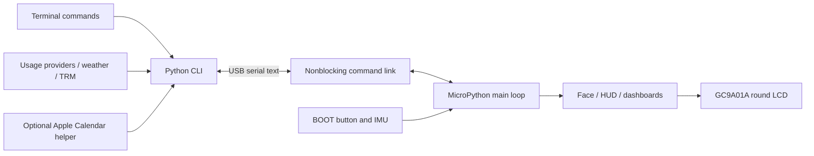

# Architecture

GBOT has two small programs: a MicroPython application on the board and a
Python command-line client on the computer. The host owns network access and
credentials. The board owns animation, controls, display state, and the
countdowns it has received.



## Source map

| Path | Responsibility |
| --- | --- |
| `firmware/main.py` | Main loop, commands, physical controls, view scheduling, persistence |
| `firmware/link.py` | Nonblocking line-oriented USB command channel |
| `firmware/gc9a01.py` | LCD initialization, transport, rotation, brightness, and colors |
| `firmware/sensors.py` | IMU acceleration, chip temperature, and voltage |
| `firmware/face.py` | Animated eyes and transitions |
| `firmware/palette.py` | Availability palettes and expression presets |
| `firmware/backdrop.py` | Shared background drawing |
| `firmware/hud.py` | Device telemetry view |
| `firmware/limits.py` | Usage, weather, TRM, and Calendar views/cards |
| `firmware/limits_font.py` | Generated Inter bitmap subset |
| `cli/gbot` | Serial client, provider adapters, local state, foreground feed |
| `host/CalendarReader.swift` | Optional macOS EventKit reader |
| `scripts/` | Installers, deployment, font generation, and previews |
| `tests/` | Host-side behavioral tests with hardware/provider fakes |

## Main loop and timing

The face targets a roughly 33 ms frame period. Input polling, motion
sampling, command processing, and view timers share the loop. Rendering
uses bounded drawing buffers rather than allocating a new full framebuffer
each frame. A slow network request never runs on the board.

There are two presentation layers: full-screen views selected by the user,
and short cards that appear during the face cycle. Availability is kept
separate from the chosen view. Feed updates refresh data without changing
availability, brightness, or the user's selected view. An eligible calendar
reminder is an intentional timed interruption.

Use `time.ticks_diff()` to measure elapsed intervals. Long provider reset
periods are tracked as remaining durations; an arbitrary multi-day future
timestamp can exceed MicroPython's supported tick arithmetic range.

## USB protocol

Commands and replies are newline-delimited text. The device returns `ok ...`
or `err ...`; unsolicited board events begin with `#`. Incoming lines are
limited to 96 characters. USB CDC also carries the MicroPython REPL, and
Ctrl-C remains available for recovery.

Examples of **wire-level** commands are:

```text
busy
view face
rotate 2
limits CLAUDE 5H,84,1830 7D,89,432000
weather set 245 2 70 1789387200
calendar set aabbccdd 300 14:00 Project review
```

These are protocol examples, not commands to paste into a shell. The CLI
validates and formats host data before transmission. The weather fields
are temperature in tenths of a degree Celsius, WMO code, humidity, and Unix
timestamp. Calendar fields are a hexadecimal event ID, remaining seconds,
`HH:MM`, and a shortened title. Check the handlers in `main.py` for current
limits and validation rules.

The CLI uses per-device locks for its own commands and releases the serial
port between polling cycles. Provider requests happen outside the serial
transaction in the watch/feed paths. `mpremote` is a separate client: stop
the feed before deployment or REPL access.

## Persistence and freshness

| Data | Storage and restart behavior |
| --- | --- |
| Availability and rotation | Board `state.txt`; restored on boot |
| Active view | Boot returns to the face |
| Usage percentages | Board `limits.txt`; writes are delayed and throttled |
| Usage reset countdowns | Runtime only; dropped on restart |
| Weather, TRM, Calendar | Supplied by the host; require refresh after restart |
| Calendar reminder deduplication | Recent event IDs in RAM |
| Host device selection and retry state | `~/.config/gbot/` |

Storing a percentage does not make it current. GBOT distinguishes stored
data from refreshed values, and the host must continue feeding the device
to maintain online dashboards. No provider credential is part of the serial
protocol or board persistence format.
